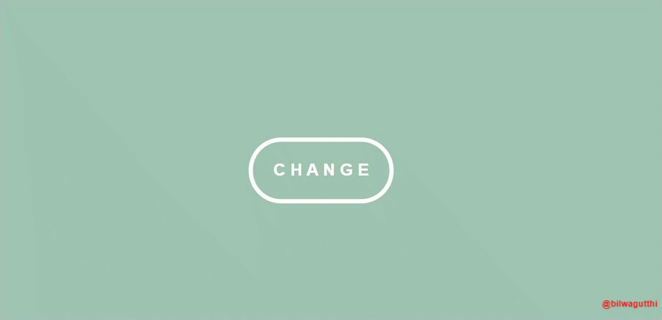

# JAVASCRIPT MINI PROJECTS
Javascript applications and games developed for practice.

---
### 01. Binary Calculator
--in progress

---
### 02. Random Background Colour
Changes the colour of the background to random colours when button is clicked

